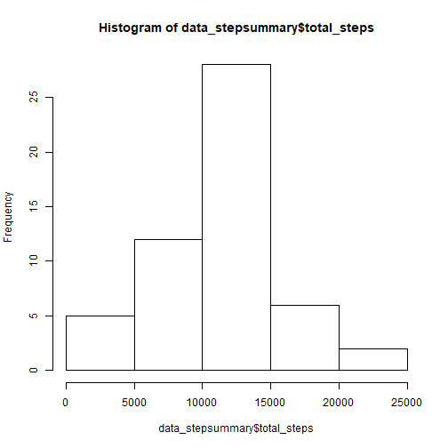
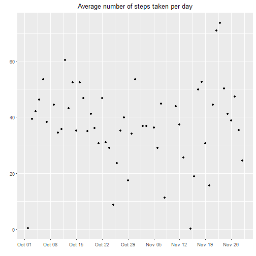
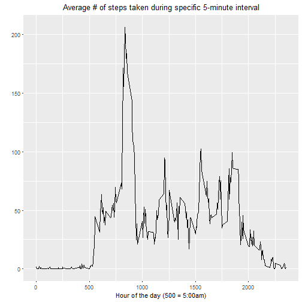
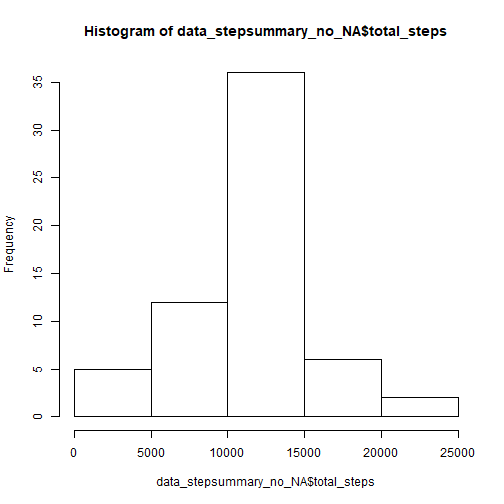
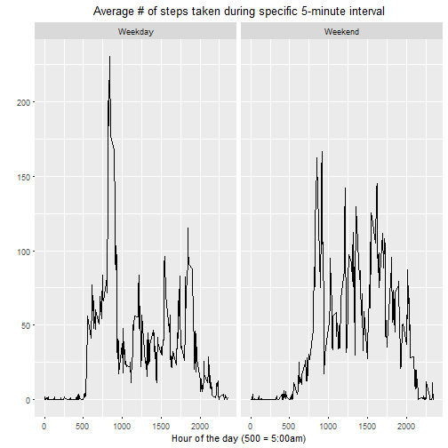

## Reproducible research assignment (Week 2)


### Download and unzip file


```r
dataURL <- "https://d396qusza40orc.cloudfront.net/repdata%2Fdata%2Factivity.zip"
file <- "Coursera_5_2.zip"
if (!file.exists(file)) {download.file(dataURL, file)}
unzip(zipfile = file, exdir = ".")
```

### Read datatable


```r
data <- read.csv("activity.csv")
head(data)
```

```
##   steps       date interval
## 1    NA 2012-10-01        0
## 2    NA 2012-10-01        5
## 3    NA 2012-10-01       10
## 4    NA 2012-10-01       15
## 5    NA 2012-10-01       20
## 6    NA 2012-10-01       25
```

```r
summary(data)
```

```
##      steps                date          interval     
##  Min.   :  0.00   2012-10-01:  288   Min.   :   0.0  
##  1st Qu.:  0.00   2012-10-02:  288   1st Qu.: 588.8  
##  Median :  0.00   2012-10-03:  288   Median :1177.5  
##  Mean   : 37.38   2012-10-04:  288   Mean   :1177.5  
##  3rd Qu.: 12.00   2012-10-05:  288   3rd Qu.:1766.2  
##  Max.   :806.00   2012-10-06:  288   Max.   :2355.0  
##  NA's   :2304     (Other)   :15840
```

### Calculating total/mean/median number of steps taken per day and making a histogram for total values


```r
data_stepsummary <- dplyr::summarise(dplyr::group_by(data, date), total_steps = sum(steps), stepmeans = mean(steps), stepmedians = median(steps))
head(data_stepsummary)
```

```
## # A tibble: 6 × 4
##         date total_steps stepmeans stepmedians
##       <fctr>       <int>     <dbl>       <dbl>
## 1 2012-10-01          NA        NA          NA
## 2 2012-10-02         126   0.43750           0
## 3 2012-10-03       11352  39.41667           0
## 4 2012-10-04       12116  42.06944           0
## 5 2012-10-05       13294  46.15972           0
## 6 2012-10-06       15420  53.54167           0
```

#### We have to note here that while stepmedian values look odd ("0s" where data is available") this is actually corrent. During majority of 5-minute intervals of the day a person collecting data did not make any steps. Also, stepmean values are for 5-minute intervals. If they get multiplied by 288, we will have daily totals.  


```r
hist(data_stepsummary$total_steps)
```



### Here is time series plot of the average number of steps taken


```r
library(ggplot2)
ggplot(subset(data_stepsummary, !is.na(stepmeans)), aes(as.Date(date), stepmeans)) + geom_point() + labs(title = "Average number of steps taken per day") + theme(plot.title = element_text(hjust = 0.5)) + labs(y = "") + labs(x = "") + scale_x_date(date_breaks = "1 week", date_labels = "%b %d")
```



### Here is time series plot of average 5-minute interval steps taken


```r
data_intervalsummary <- dplyr::summarise(dplyr::group_by(data, interval), mean_steps = mean(steps, na.rm = TRUE))
library(ggplot2)
ggplot(data_intervalsummary, aes(interval, mean_steps)) + geom_line() + labs(title = "Average # of steps taken during specific 5-minute interval") + theme(plot.title = element_text(hjust = 0.5)) + labs(y = "") + labs(x = "Hour of the day (500 = 5:00am)")
```



### What is the time interval for maximum number of steps?


```r
max <- subset(data_intervalsummary, mean_steps == max(mean_steps))
max
```

```
## # A tibble: 1 × 2
##   interval mean_steps
##      <int>      <dbl>
## 1      835   206.1698
```

##### This 5-minute interval starts at 8:35 am and an average daily amount of steps is above 206

### Total number of missing values in dataset.


```r
sum(is.na(data))
```

```
## [1] 2304
```

```r
sum(is.na(data$steps))
```

```
## [1] 2304
```

### All missing values are in "steps" column (2304 = 2304). They will be substituted by mean values for identical 5-minute interval.


```r
data$steps <- ifelse(is.na(data$steps), data_intervalsummary$mean_steps, data$steps)
head(data)
```

```
##       steps       date interval
## 1 1.7169811 2012-10-01        0
## 2 0.3396226 2012-10-01        5
## 3 0.1320755 2012-10-01       10
## 4 0.1509434 2012-10-01       15
## 5 0.0754717 2012-10-01       20
## 6 2.0943396 2012-10-01       25
```

```r
sum(is.na(data))
```

```
## [1] 0
```

##### Data does not contain missing values any longer


```r
data_stepsummary_no_NA <- dplyr::summarise(dplyr::group_by(data, date), total_steps = sum(steps), stepmeans = mean(steps), stepmedians = median(steps))
head(data_stepsummary_no_NA)
```

```
## # A tibble: 6 × 4
##         date total_steps stepmeans stepmedians
##       <fctr>       <dbl>     <dbl>       <dbl>
## 1 2012-10-01    10766.19  37.38260    34.11321
## 2 2012-10-02      126.00   0.43750     0.00000
## 3 2012-10-03    11352.00  39.41667     0.00000
## 4 2012-10-04    12116.00  42.06944     0.00000
## 5 2012-10-05    13294.00  46.15972     0.00000
## 6 2012-10-06    15420.00  53.54167     0.00000
```

```r
hist(data_stepsummary_no_NA$total_steps)
```



```r
data_stepsummary_no_NA$stepmeans - data_stepsummary$stepmeans
```

```
##  [1] NA  0  0  0  0  0  0 NA  0  0  0  0  0  0  0  0  0  0  0  0  0  0  0
## [24]  0  0  0  0  0  0  0  0 NA  0  0 NA  0  0  0  0 NA NA  0  0  0 NA  0
## [47]  0  0  0  0  0  0  0  0  0  0  0  0  0  0 NA
```

```r
data_stepsummary_no_NA$stepmedians - data_stepsummary$stepmedians
```

```
##  [1] NA  0  0  0  0  0  0 NA  0  0  0  0  0  0  0  0  0  0  0  0  0  0  0
## [24]  0  0  0  0  0  0  0  0 NA  0  0 NA  0  0  0  0 NA NA  0  0  0 NA  0
## [47]  0  0  0  0  0  0  0  0  0  0  0  0  0  0 NA
```

##### Histogram is slighly different from the one with NA data rows. Frequency of "total steps" values in a range between 10000 and 15000 is higher - this is due to NA rows replaced by mean values which end up in the center of this distribution. When NA data was imputed with mean values, it had no impact on days with no NAs (zeros in subtraction equation)

##### A new factor variable in the dataset with two levels - "weekday" and "weekend" indicating whether a given date is a weekday or weekend day is now created

```r
data_factor <- dplyr::mutate(data, factor = weekdays(as.Date(data$date)))
data_factor$factor <- ifelse(data_factor$factor == "Saturday" | data_factor$factor == "Sunday", "Weekend", "Weekday")
unique(data_factor$factor)
```

```
## [1] "Weekday" "Weekend"
```

### Grouping data by 2 variables: 5-minute interval and Weekday/Weekend factor

```r
data_factor_intervalsummary <- dplyr::summarise(dplyr::group_by(data_factor, interval, factor), mean_steps = mean(steps))
head(data_factor_intervalsummary)
```

```
## Source: local data frame [6 x 3]
## Groups: interval [3]
## 
##   interval  factor mean_steps
##      <int>   <chr>      <dbl>
## 1        0 Weekday 2.25115304
## 2        0 Weekend 0.21462264
## 3        5 Weekday 0.44528302
## 4        5 Weekend 0.04245283
## 5       10 Weekday 0.17316562
## 6       10 Weekend 0.01650943
```
### Building a panel plot for above summarized data.


```r
ggplot(data_factor_intervalsummary, aes(interval, mean_steps)) + geom_line() + facet_grid(.~ factor) + labs(title = "Average # of steps taken during specific 5-minute interval") + theme(plot.title = element_text(hjust = 0.5)) + labs(y = "") + labs(x = "Hour of the day (500 = 5:00am)")
```


